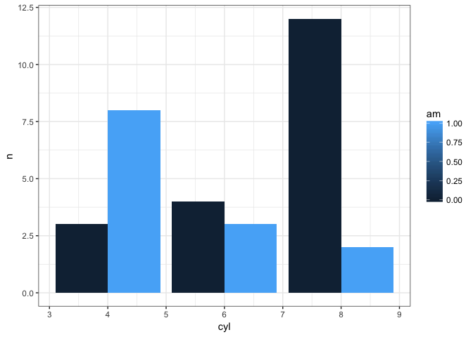
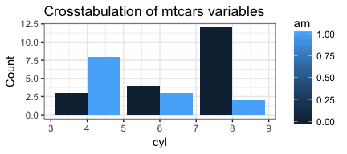
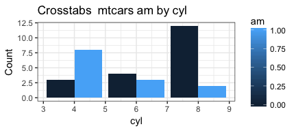
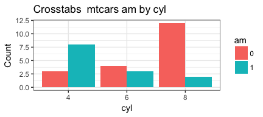
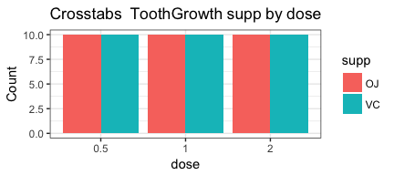

Writing better R functions part one – April 6, 2018
================
Chuck Powell
4/6/2018

One of the nicest things about working with `R` is that with very little
effort you can customize and automate activities to produce the output
you want – just the way you want it. You can contrast that with more
monolithic packages that may allow you to do a bit of scripting, but for
the most part, the price of a GUI or packaging everything in one package
is that you lose the ability to have things just your way. Since
everything in `R` is pretty much a function already, you may as well
invest a little time and energy in making functions… your way, and to
exactly your tastes and needs. This post is not meant to be an
exhaustive or complete treatment of writing a function. For that you
probably want a book, or at least a [Chapter like the one Hadley has in
Advanced R](https://adv-r.hadley.nz/functions.html). This post will
focus on a very practical, and hopefully useful, single example.

In my last three posts I have been writing about automating activities
in R. You can [review everything that happened in the first
post](https://ibecav.github.io/Functionalize/), [as well as the
second](https://ibecav.github.io/RtoExcel/), [or the
third](https://ibecav.github.io/customize/) (**which I strongly
recommend**), or you can start on this page. There is no need to save
the same dataset or go through the process of building that dataset if
you don’t want to. For our purposes in this post we’re going to make use
of the built in dataframe known as `mtcars`. We’re doing that to make
sure that whatever we do in this post today, it works on a known start
point so we can compare and contrast. One of the most painful learning
experiences you can have in `R` is to discover that you have written
something so specific it won’t generalize to other data or other
situations.

## Background and catch-up

In our earlier postings we dealt with our desire to have some automated
tools (functions) that took pairs of variables from a dataset and
produced some nice useful `ggplot` plots from them. We started with the
simplest case like plotting counts of how two variables cross-tabulate
and then worked our way up to being able to automate the process of
plotting lots of pairings of variables from the same dataframe. Today
we’ll improve our functions even more and add some **features**.

First some basic setup.

``` r
knitr::opts_chunk$set(echo = TRUE, warning = FALSE)
library(dplyr)
```

    ## 
    ## Attaching package: 'dplyr'

    ## The following objects are masked from 'package:stats':
    ## 
    ##     filter, lag

    ## The following objects are masked from 'package:base':
    ## 
    ##     intersect, setdiff, setequal, union

``` r
library(ggplot2)
theme_set(theme_bw()) # set theme to my personal preference
```

## Where we left off

At the end of the last post we had accomplished two important feats:

1.  We had a function called `PlotMe` that took the name of a dataframe
    and two variables, cross-tabulated their counts, and created a nice
    plot for us.
2.  We had some lines of code (not yet a function) that took the name of
    a dataframe and the numbers of the columns we were interested in,
    and created two lists that we could feed to `mapply` so that we
    could make lots of plots with little additional effort

Along the way we learned the **“tricks”** of working with `dplyr` and
`ggplot2` inside of functions \[1\]. So using the `mtcars` dataset as
our example data we started here with something that works in the
console:

``` r
### with dplyr and ggplot manually
mtcars %>%
  filter(!is.na(am), !is.na(cyl))  %>%
  group_by(am,cyl) %>%
  count() %>%
  ggplot(aes(fill=am, y=n, x=cyl)) +
    geom_bar(position="dodge", stat="identity")
```

<!-- -->

then turned it into a function after we learned about `NSE`:

``` r
PlotMe <- function(dataframe,x,y){
   aaa <- enquo(x)
   bbb <- enquo(y)
   dataframe %>%
      filter(!is.na(!! aaa), !is.na(!! bbb))  %>%
      group_by(!! aaa,!! bbb) %>%
      count() %>%
      ggplot(aes_(fill=aaa, y=~n, x=bbb)) +
         geom_bar(position="dodge", stat="identity") ->p
   plot(p)
}
PlotMe(mtcars,am,cyl)
```

<!-- -->

> **Note that with `dplyr` if we don’t `filter` out `NA`’s we will see
> them plotted which may or may not be what you want substantively\!**

> **From this point forward I’m going to print the plots in a smaller
> size. I’m doing that via RMarkdown and it won’t happen automatically
> for you if you download and use the code.**

We also wrote some code that allows us to be more efficient if we want
to print multiple pairings in the same data set. The `cat` statement is
unnecessary I simply inserted it so you can see how the loops provide
what we need. We’ll remove it in the final version of the function most
likely.

``` r
# Build two vectors
xwhich <- c(2,10:11) # let's put cyl, gear, and carb in here
ywhich <- c(8:9) # let's put vs and am in here
indvars<-list() # create empty list to add to
depvars<-list() # create empty list to add to
totalcombos <- 1 # keep track of where we are
# loop through the vectors and build our lists
for (j in seq_along(xwhich)) {
  for (k in seq_along(ywhich)) {
    depvars[[totalcombos]] <- as.name(colnames(mtcars[xwhich[[j]]]))
    indvars[[totalcombos]] <- as.name(colnames(mtcars[ywhich[[k]]]))
    cat("iteration #", totalcombos, 
        " xwhich=", xwhich[[j]], " depvars = ", as.name(colnames(mtcars[xwhich[[j]]])),
        " ywhich=", ywhich[[k]], " indvars = ", as.name(colnames(mtcars[ywhich[[k]]])),
        "\n", sep = "")
    totalcombos <- totalcombos +1
  }
}
```

    ## iteration #1 xwhich=2 depvars = cyl ywhich=8 indvars = vs
    ## iteration #2 xwhich=2 depvars = cyl ywhich=9 indvars = am
    ## iteration #3 xwhich=10 depvars = gear ywhich=8 indvars = vs
    ## iteration #4 xwhich=10 depvars = gear ywhich=9 indvars = am
    ## iteration #5 xwhich=11 depvars = carb ywhich=8 indvars = vs
    ## iteration #6 xwhich=11 depvars = carb ywhich=9 indvars = am

This code produces two lists with the column names varying in the way we
want them. Then we can pass it to our `PlotMe` function to get our 6
plots back as desired. So `mapply(PlotMe, x=indvars, y=depvars, MoreArgs
= list(dataframe=mtcars))`.

## Making our function better

Other things we’d like to accomplish:

1.  Do a better job of labeling the plot properly.  
2.  Add some basic error checking and simple fixes
3.  Let the user choose from different options for which graph type
    communicates their points about the data.
4.  Convert the second block of code into a proper function.

Let’s start with the first item. As a minimum we can add a title with
`ggtitle("Crosstabulation of mtcars variables")` and `ylab("Count")`

``` r
PlotMe <- function(dataframe,x,y){
   aaa <- enquo(x)
   bbb <- enquo(y)
   dataframe %>%
      filter(!is.na(!! aaa), !is.na(!! bbb))  %>%
      group_by(!! aaa,!! bbb) %>%
      count() %>%
      ggplot(aes_(fill=aaa, y=~n, x=bbb)) +
         geom_bar(position="dodge", stat="identity") +
         ggtitle("Crosstabulation of mtcars variables") +
         ylab("Count") ->p
   plot(p)
}
PlotMe(mtcars,am,cyl)
```

<!-- -->

Totally uninspired but serviceable. Better yet is to use `bquote` and
the `.()` notation to make it more pertinent and portable. Notice that
we had to create a new object called `dfname` to hold the name of the
dataframe and that the name is quoted. So that means that inside our
function `dataframe` actually refers to the whole dataset `mtcars` all
the rows and columns and data itself. `dfname` on the other hand, is
just a way for us to print out the word **mtcars** without having to
hard code it in. No matter what dataframe we pass in to the function the
right name gets printed. **NB** friendly reminder that if you try and
cheat and pass `x` or `y` to bquote they will fail miserably the `enquo`
is essential.

``` r
PlotMe <- function(dataframe,x,y){
   aaa <- enquo(x)
   bbb <- enquo(y)
   dfname <- enquo(dataframe)
   dataframe %>%
      filter(!is.na(!! aaa), !is.na(!! bbb))  %>%
      group_by(!! aaa,!! bbb) %>%
      count() %>%
      ggplot(aes_(fill=aaa, y=~n, x=bbb)) +
         geom_bar(position="dodge", stat="identity") +
         ggtitle(bquote("Crosstabs"~.(dfname)*.(aaa)~"by"*.(bbb))) +
         ylab("Count") ->p
   plot(p)
}
PlotMe(mtcars,am,cyl)
```

<!-- -->

Okay enough for now. Maybe later we’ll do something about *am* and *cyl*
as labels. If the `mtcars` dataframe used better column names we
wouldn’t have this problem but we’re good enough for now. We have a
much “bigger” problem in my mind. Because `am` is an integer our
`ggplot` is sort of ugly. Remember we built it for a different data set
where the variables of interest were already `factors` not `integers`.
`am` is a factor (whether or not the car has an automatic transmission)
posing as an integer but `ggplot` doesn’t know that and tries to
helpfully give us a display suitable for a number not a factor.

That’s the fun of building and testing a function, it’s looking for all
the ways you can go wrong. So let’s fix this because that funny shaded
bar for `am` is driving me crazy.

Now if we were doing this with `dplyr` outside of a function it would be
simple. What we want is just…

``` r
mtcars %>%
  filter(!is.na(am), !is.na(cyl))  %>%
  mutate(am = factor(am), cyl = factor(cyl)) %>%
  group_by(am,cyl) %>%
  count()
```

    ## # A tibble: 6 x 3
    ## # Groups:   am, cyl [6]
    ##   am    cyl       n
    ##   <fct> <fct> <int>
    ## 1 0     4         3
    ## 2 0     6         4
    ## 3 0     8        12
    ## 4 1     4         8
    ## 5 1     6         3
    ## 6 1     8         2

The problem is we’re inside a function and just as with our `filter` and
`group_by` commands we need to make it clear to `mutate` exactly what
objects we’re talking about. We know that `!!aaa` is what we have used
so `factor(!!aaa)` makes sense on the right hand side of any `mutate`
because we are trying to make a factor of the variable `aaa` in the
`dataframe`. The left hand side is in no way intuitive to me but the
right answer is `!!quo_name(aaa)` and to make matters even more complex
(and I’m quoting the help pages here) you can’t use the equals sign:

> Unfortunately R is very strict about the kind of expressions supported
> on the LHS of =. This is why we have made the more flexible :=
> operator an alias of =. You can use it to supply names, e.g. a := b is
> equivalent to a = b. Since its syntax is more flexible you can unquote
> on the LHS:

so instead of `=` we’ll use `:=` but most importantly as you’ll see from
the code below it works and produces the tibble we need to drive
`ggplot` to produce the output we’d like…

``` r
PlotMe <- function(dataframe,x,y){
  aaa <- enquo(x)
  bbb <- enquo(y)
  dfname <- enquo(dataframe)
  dataframe %>%
    filter(!is.na(!! aaa), !is.na(!! bbb))  %>%
    mutate(!!quo_name(aaa) := factor(!!aaa), !!quo_name(bbb) := factor(!!bbb)) %>%
    group_by(!! aaa,!! bbb) %>%
    count() %>%
    ggplot(aes_(fill=aaa, y=~n, x=bbb)) +
      geom_bar(position="dodge", stat="identity") +
      ggtitle(bquote("Crosstabs"~.(dfname)*.(aaa)~"by"*.(bbb))) +
      ylab("Count") ->p
  plot(p)
}
PlotMe(mtcars,am,cyl)
```

<!-- -->

Okay, we’ve made improvements to our labeling. We’ve caught a minor fix
that was because we made an *assumption* that our variables would always
be factors (because that’s what you cross-tabulate) and forced them to
factors.

Seems a good time to add some error checking inside the function to make
sure it works across a variety of situations.

## Everyone makes mistakes

The first few functions I wrote I didn’t worry about error-checking.
After all I was the only user and I’d be fine. Little did I know that I
would forget the next time I used a function months later. Or that a
simple typo would drive me to distraction because the error message `R`
threw would offer me no understanding. So these days unless it is a very
simple function, I add some error checking early on. The sorts of things
I check for are in this list:

1.  If your function relies on certain libraries, test for them with a
    `require` statement.
2.  Good chance to set some defaults you like, such as
    `theme_set(theme_bw())`.
3.  Did the user pass you the right number of arguments?
4.  Is the first argument a valid dataframe?
5.  If, like me, you’re asking for a dataframe and some columns in it,
    are the variables present in the dataframe?
6.  What if anything will you do about missing values?

Typically I have statements I simply cut and paste from one function to
the next as needed (feel free to borrow anything of mine you see you
like). Some easy examples I’ll pass along to you in this next version of
the function. I also find it useful to try the function on different
datasets just to make sure I’m not building something that only works on
`mtcars` so I’ve added a plot for `ToothGrowth` even if it is a bit
contrived.

``` r
PlotMe <- function(dataframe,x,y){
# error checking
  if (!require(ggplot2)) {
    stop("Can't continue can't load ggplot2")
  }
  theme_set(theme_bw())
  if (!require(dplyr)) {
    stop("Can't continue can't load dplyr")
  }
  dfname <- enquo(dataframe)
  if (length(match.call()) <= 3) {
    stop("Not enough arguments passed... requires a dataframe, plus two variables")
  }
  if (!exists(deparse(substitute(dataframe)))) {
     stop("The first item in your list does not exist")
  }
  if (!is(dataframe, "data.frame")) {
    stop("The first name you passed does not appear to be a data frame")
  }
  if (!deparse(substitute(x)) %in% names(dataframe)) {
    stop(paste0("'", deparse(substitute(x)), "' is not the name of a variable in '",deparse(substitute(dataframe)),"'"))
  }
  if (!deparse(substitute(y)) %in% names(dataframe)) {
    stop(paste0("'", deparse(substitute(y)), "' is not the name of a variable in '",deparse(substitute(dataframe)),"'"), call. = FALSE)
  }
  missing <- apply(is.na(dataframe[,c(deparse(substitute(x)),deparse(substitute(y)))]), 1, any)
  if (any(missing)) {
    warning(paste(sum(missing)), " row(s) not plotted because of missing data")
  }
  aaa <- enquo(x)
  bbb <- enquo(y)
  dataframe %>%
    filter(!is.na(!! aaa), !is.na(!! bbb))  %>%
    mutate(!!quo_name(aaa) := factor(!!aaa), !!quo_name(bbb) := factor(!!bbb)) %>%
    group_by(!! aaa,!! bbb) %>%
    count() %>%
    ggplot(aes_(fill=aaa, y=~n, x=bbb)) +
      geom_bar(position="dodge", stat="identity") +
      ggtitle(bquote("Crosstabs"~.(dfname)*.(aaa)~"by"*.(bbb))) +
      ylab("Count") ->p
  plot(p)
}
PlotMe(mtcars,am,cyl)
```

<!-- -->

``` r
PlotMe(ToothGrowth,supp,dose)
```

<!-- -->

It may seem silly to have more lines of error-checking than code but
trust me it’s worth it in the long haul. I like to test and see what
happens for at least some common or likely mistakes that I or another
user might make. Part of my planning is to try and return the most
helpful or useful error or warning message I can. Try them if you like…

``` r
PlotMe(mtcars) # too few parameters
# Error in PlotMe(mtcars) : 
#   Not enough arguments passed... requires a dataframe, plus two variables
PlotMe(MtCaRs,am,cyl) # dataframe doesn't exist
# Error in PlotMe(MtCaRs, am, cyl) : 
#  The first item in your list does not exist
PlotMe(PlotMe,am,Cyl) # it exists but it's not a data frame
# Error in PlotMe(PlotMe, am, Cyl) : 
#  The first name you passed does not appear to be a data frame
PlotMe(mtcars,AM,cyl) # one variable doesn't exist
# Error in PlotMe(mtcars, AM, cyl) : 
#  'AM' is not the name of a variable in 'mtcars'
PlotMe(mtcars,am,Cyl) # the other doesn't exist
# Error: 'Cyl' is not the name of a variable in 'mtcars'
## Create a copy of mtcars 
MtCaR <- mtcars
# insert a missing value
MtCaR[1,2] <- NA
PlotMe(MtCaR,am,cyl) # warn about missings
#     Warning message:
#     In PlotMe(MtCaR, am, cyl) : 1 case(s) not plotted because of missing data
```

One of the reasons the function is much longer is that for my own sanity
I like to make the error checking as explicit and sequential and
thorough as I can. No nested if statements for me thanks. And first I
test if the user passed me a valid `R` object as the first parameter and
then I test to see if it is actually a dataframe.

## All done (not yet\!)

This has become a very long post so I’m going to end here. Next post
I’ll address letting the user choose which type of plot they’d like,
as well as turning our other bunch of code into a proper function.

I hope you’ve found this useful. I am always open to comments,
corrections and suggestions.

Chuck (ibecav at gmail dot
com)

### License

<a rel="license" href="http://creativecommons.org/licenses/by-sa/4.0/"></a><br />This
work is licensed under a
<a rel="license" href="http://creativecommons.org/licenses/by-sa/4.0/">Creative
Commons Attribution-ShareAlike 4.0 International License</a>.

1.  Now, I happen to love using `dplyr`, it is so elegant, and the
    syntax, plus piping, is just a joy to work with. But the downside is
    that it was originally designed to be used at the command prompt
    interactively. It makes heavy use of **non standard evaluation**
    `NSE` which [makes it tricky to program functions
    with](https://adv-r.hadley.nz/meta.html#). Not impossible, but
    tricky. [Hadley Wickham has written about it
    extensively](http://dplyr.tidyverse.org/articles/programming.html)
    and the [Stack
    Overflow](https://stackoverflow.com/questions/27975124/pass-arguments-to-dplyr-functions/44594223)
    is full of questions about it, so I’m not sure I’m the person to
    explain it. But I can show a practical example of how to use it. And
    if you’re like me that is sometimes very helpful.
